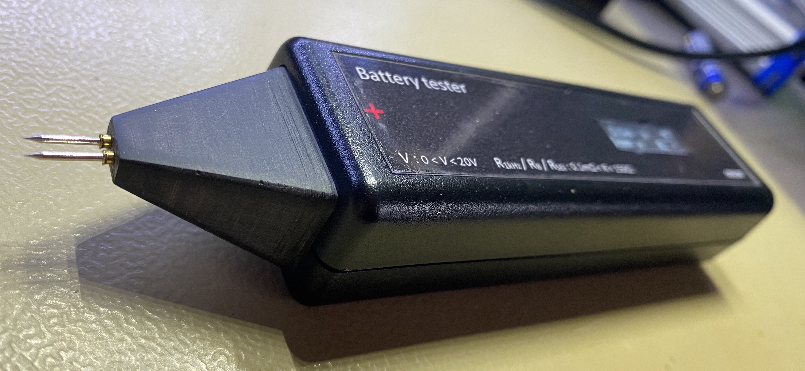
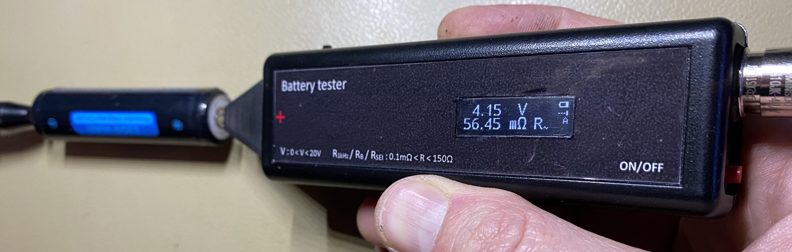
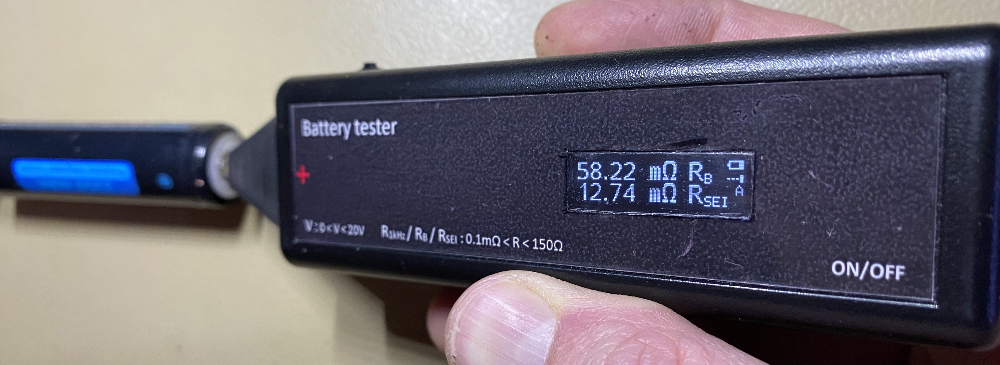
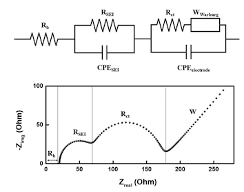
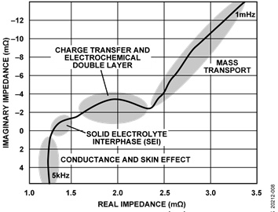

# Handheld Battery Meter on Attiny series 2 <!-- omit in toc -->

This repository is about a "pen size" (handheld) tool for quick measurement of various types of battery resistances/impedances.

This tool uses 2 different methods for measuring impedance values:

- "standard" AC 1 kHz impedance, as used by many
- Direct Current Impedance Spectroscopy, extracting the bulk (solution) resistance and the SEI (Solid Electrolyte Interphase) resistance

## Contents <!-- omit in toc -->

This document handles the reasoning behind the creation of this tool, the methods used, the software and the hardware.

- [Design restrictions](#design-restrictions)
- [Norms and introduction to measurement techniques used](#norms-and-introduction-to-measurement-techniques-used)
- [Battery Equivalent Circuit Model, Spectrum, and the EIS method](#battery-equivalent-circuit-model-spectrum-and-the-eis-method)
  - [Battery Equivalent Circuit Model](#battery-equivalent-circuit-model)
  - [EIS](#eis)
  - [Tools](#tools)
  - [CN0510](#cn0510)
  - [Model fitting](#model-fitting)
  - [Further information](#further-information)
- [Time Domain / DCIS method](#time-domain--dcis-method)
  - [Non-linear behaviour](#non-linear-behaviour)
  - [Pulse timing](#pulse-timing)
  - [Adaptation to other battery layouts or chemistries](#adaptation-to-other-battery-layouts-or-chemistries)
  - [Ratiometric approach](#ratiometric-approach)
  - [Offset cancelling](#offset-cancelling)
  - [Power line Frequency compensation](#power-line-frequency-compensation)
- [Internal Impedance (AC) measurement](#internal-impedance-ac-measurement)
  - [Current levels and test duration](#current-levels-and-test-duration)
  - [Implementation of the sine wave generation](#implementation-of-the-sine-wave-generation)
  - [AC Analysis method](#ac-analysis-method)
  - [ADC sampling considerations](#adc-sampling-considerations)
  - [Ratiometric approach, Offset cancelling, Power line Frequency compensation](#ratiometric-approach-offset-cancelling-power-line-frequency-compensation)
- [Internal Resistance (DC/IR) measurement](#internal-resistance-dcir-measurement)
- [CPU and Software environment](#cpu-and-software-environment)
- [Construction, Connectors, other hardware](#construction-connectors-other-hardware)
  - [Charging](#charging)
- [Buttons](#buttons)
- [Calibration](#calibration)
- [Remote control, SCPI](#remote-control-scpi)
- [Specifications](#specifications)
  - [Voltage](#voltage)
  - [Resistance](#resistance)
- [Repository contents](#repository-contents)
- [Imperfections, TODO's](#imperfections-todos)

---

## Design restrictions

This tool was designed with the following design restrictions:

- handheld, therefore:
  - small
  - limited controls, ideally by 1 finger while measuring
  - "large enough" screen
  - rechargeable
  - no need to cover a large temperature range
- fast measurement
- easy to use
- for use on regular small batteries. No large capacity car batteries or large UPS batteries, and nothing requiring extreme precision. Therefore:
  - at least 0 to 20 Ω, with, and at least 1 mΩ resolution at the lowest range.
  - at least 1V to 16V, and at least 10mV resolution.
  - at least 3 significant digits.
- precision is more important than accuracy. However, 1% accuracy should be attainable on resistance values. Voltage accuracy is of lower priority, as my DMMs can be used for that, and the voltage is less significant in most cases. Therefore:
  - aim for low noise
  - the accuracy of the measuring techniques should depend on as few as possible variables.
  - calibration must be possible.
- USB charging and USB interface
- hand assembly and hand soldering. For me, that means:
  - no BGA or QFN, as I don't have a reflow oven and am too much of a cheapskate to order stencils for the 1 or 2 PCBs I'll make.
  - 0805 components and VSSOP/MSOP 0.5mm pitch are the low limits
  - as a side effect, I can now freely use both sides of the PCB because I don't have to care about warping or components falling off the other side while soldering with hot air.
- using components that I can find in this period of component shortage. This means that sometimes there might be cheaper or better components, they were just not available when I selected them.
- using an Attiny series 2 CPU, because I wanted to try that out and it looked just capable enough. I really would have liked to use the RP2040, but it is not hand solderable enough. Maybe later.
- capable of using the probes that come with the YR1035+, as I also have that tool, and like the connector/probe ease of use/availability. It will also allow me to have easier comparisons.

## Norms and introduction to measurement techniques used

Battery impedance is a complicated subject. A battery does not have <u>one</u> impedance, and even if you get a number, it can mean many things. Also, the battery impedance depends on a lot of different things, like state of charge (SoC), state of health (SoH), temperature, and of course the measurement method. Therefore, various norms exist for measuring the various resistances and impedances of the different battery types. Some of them are:

- IEC 61951-1: NiCd
- IEC 61951-2: NiMH
- IEC 62660-1/2: Li-Ion
- IEC 61960-4: Lithium coin cells

Outside of these norms, various other test methods have arisen lately. Below is an explanation of the different methods I investigated.

---

## Battery Equivalent Circuit Model, Spectrum, and the EIS method

### Battery Equivalent Circuit Model

Various models of battery impedance exist, depending on the chemistry. For Li-Ion cells, the "Combined Randle and Warburg Circuit Model" is often cited as fairly complete, and, with some variations, also applicable to some other chemistries.

*Equivalent circuit model of a Li-Ion battery half-cell system, and nyquist plot of a frequency sweep.*
([source](https://www.jecst.org/upload/pdf/jecst-2019-00528.pdf))

*Nyquist plot, related to Li-Ion cell chemical processes.*
([source](https://www.analog.com/en/design-center/reference-designs/circuits-from-the-lab/CN0510.html))

### EIS

The EIS (Electrochemical Impedance Spectroscopy) method allows one to get a good view of the various components of the battery impedance. With this method an AC load of varying frequency is imposed on the battery, and the voltage swing over the battery is measured. The frequency sweep can go from the millihertz into the megahertz range, and can be used to generate a Nyquist plot like shown above.

Through model fitting, the values of the individual components in the model can than be determined.

For Li-Ion, the values of these components can be used as indicators.

- Rb (aka Rs or RΩ in other literature) = Bulk (or Solution) resistance. Increases when the battery ages.
- RSEI = Solid Electrolyte Interphase resistance. Is an indication of battery safety: it increases for example when the battery has been overcharged.
- Rct = Charge Transfer resistance. Increases when the battery is discharged, and when the temperature is lower. At a stable temperature and SoC, it is also a very good indication of battery health.

As an example, experimental results on Li-Ion batteries show that when the battery capacity drops from 3100 mAh to 2600 mAh due to ageing, the value of Rb rises from 44 mΩ to 51 mΩ, the value of RSEI remains between 6 mΩ and 7 mΩ, and the value of Rct rises from 6 mΩ to 20 mΩ.

In spite of the insights EIS can give, it has a couple of drawbacks:

- The values are strongly dependent on the battery chemistry and construction details.
- Interpretation can be complicated.
- The data is too complex to show on a small screen.
- A full EIS test generally takes significant time

As a result, this method is very interesting, but unsuited for implementation in a handheld tool.

Fast measurement of full impedance spectra is possible via the use of multi-sine methods, or via time domain methods. More about this later on.

### Tools

Few "small lab" tools exist that support EIS. Examples are the [Biologic Potentiostat](https://www.biologic.net/product_category/potentiostats-galvanostats/), [Hioki IM3590 and BT4560](https://www.hioki.com/download/37483), or the [BK Precision BA8100](https://www.bkprecision.com/products/electrical-battery-testers/BA8100), all costing several thousands of Euros. But one can already get an idea about EIS via the CN0510 circuit, for a significantly lower budget:

### CN0510

An implementation example of a tool is [CN0510 from analog.com](https://www.analog.com/en/design-center/reference-designs/circuits-from-the-lab/CN0510.html). It allows EIS measurements on various types of batteries. Note however that the signal handling board (EVAL-AD5941BATZ), by default, is only usable in the frequency range of about 4Hz - 5Khz. Outside of that, the accuracy is degraded, and below 1Hz, the noise of the input circuitry gets quite noticeable (1/f noise). With the following minor modifications, 0.5Hz - 5kHz can be made possible though:

- add U4 (otherwise the first couple of seconds of measurements are totally off)
- change C5, C6, C36, C37, C38, C39 from 2.2uF to 10uF.
- change R18, R19, R2, R3, R4, R5 from 2Meg to 10Meg.

### Model fitting

For the impedance analysis and the model fitting, several software packages exist, like [ZView](https://www.scribner.com/software/) or [impedance.py](https://github.com/ECSHackWeek/impedance.py). See the [/EISMeasurements](/EISMeasurements) directory in this repository for some fitting tests with both of these tools.

### Further information

For more information on EIS and alternative methods, see for example <https://www.gamry.com/application-notes/EIS/basics-of-electrochemical-impedance-spectroscopy/> or <https://doi.org/10.1016/j.jpowsour.2020.228742>.

Note that EIS is used in a lot of fields, not only for batteries. However, research on batteries has gotten a significant boost lately with the widespread arrival of electric cars.

---

## Time Domain / DCIS method

As mentioned above, EIS frequency domain analysis is not only complicated, but also lengthy. Time domain analysis methods have come up lately that allow acceptable approximations to the results that can be obtained via EIS. One of the approaches is called DCIS (Direct Current Impedance Spectroscopy), which is described here: <https://www.mdpi.com/1996-1073/14/15/4396/htm>

The idea behind DCIS (and other time domain methods) is that when one exposes the battery to current pulses, the voltage relaxation times give away details of the different RC components in the battery model. Care must be taken to exclude non linear behaviour and to tune the current pulses in such a way that the correct components can be derived easily.

### Non-linear behaviour

One key phrase:

> In the battery model, when the polarization potential change |∆ϕ| caused by an external signal is less than 10 mV and the signal time is short enough, the effect of concentration polarization (Zd in battery model) can be ignored.

I therefore need to keep the test currents low, and the pulses short. Both requirements perfectly fit my tool's design requirements.

### Pulse timing

In regular Li-Ion batteries, the various components show at various frequencies:

- Rb: > 1kHz
- RSEI (and CPESEI): > 1Hz, < 1kHz
- Rct (and CPEelectrode and W): < 1Hz

The approach is that for every individual component, 1 specific timed constant current pulse will be used. The width of the pulse is about 5 * RC time of the component. That gives:

- for Rb: T1 = 0.25ms
- for RSEI: T2 = 10ms
- for Rct: T3 = 400ms

The pulses are spaced out by a small relaxation time. The voltage drop over the battery is measured at the end of each current pulse, and the battery resistance at that point in time is calculated:

- for T1: Vdrop / Ipulse = Rb
- for T2: Vdrop / Ipulse = Rb + RSEI
- for T3: Vdrop / Ipulse = Rb + RSEI + Rct

Unfortunately, I will want to do multiple measurements to drown out noise and do power line frequency compensation. That makes T3 unsuited for my tool, and I must limit myself to  Rb and RSEI.

### Adaptation to other battery layouts or chemistries

The timings mentioned above are suitable for your average Li-Ion 18650 cell. If you want to use the DCIS method on other battery layouts or chemistries, you can adapt the timings via SCPI commands (see `CAL:T(1|2|PAUSE) {uint16}` below).

### Ratiometric approach

The current pulse is sent through the battery, that is placed in series with a known resistor.
The battery resistance is deducted from the relation between the voltage fluctuation over the known resistor and the voltage fluctuation over the battery. Hence, there is no need for a known current source, nor a known voltage reference.

With Ubatt as the voltage drop over the battery, Uref the voltage over the reference resistor, and Rref the reference resistor: Rbatt = Rref * (Ubatt/Uref).

Since Ubatt and Uref are so small, they are amplified by an AC coupled low noise instrumentation amplifier. The output signal is fed into the differential ADC of the processor. In order to avoid amplification differences and other signal path differences, multiplexing via a common measurement circuit is used. An input switch allows switching between the battery and the reference resistor.

The frequency cut-off point of the high-pass filter at the input of the instrumentation amplifier is well below the frequencies used in the measurements.

### Offset cancelling

The (potentially large) DC offset at the entry of the circuit is cancelled at the start of the measurements, by a low impedance short of the signal to VCC/2. The short is applied for as long is needed, and stopped when the processor sees a close to 0V differential signal on the ADC.

### Power line Frequency compensation

In order to reduce the noise and the influence of the power line frequency, multiple samples are taken, and the results are averaged. The timing of the samples is adapted to the configured power line frequency: an identical number of samples is taken for each opposing polarity of the power line signal.

The software allows setting of the power line frequency (50 or 60) vis SCPI commands.

---

## Internal Impedance (AC) measurement

This is the industry standard AC 1kHz test. A small 1kHz current (ideally sine wave) is applied to the battery, and the AC voltage at the battery is measured. The impedance is then deducted from the current and the voltage.
This method is widespread, low power, and fast, so I can include it in my tool.

### Current levels and test duration

The maximum voltage swing allowed depends on the battery type, as above certain levels, the values would be skewed by other factors. For NiCd, that limit is about 20mV, and for Lithium chemistries, 10mV seems to be indicated. As a result, I do not set a test specific current, but adapt the test current to the selected range.

The "correct" duration of the test varies. EC 61951-1 for example states that the test duration must be 1 to 5 seconds, but that is not handy for fast manual use. A test duration of 100ms suffices normally.

### Implementation of the sine wave generation

The CPU I chose does not have a sine wave generator. It does have PWM, but making a sine wave with that was hard to do while running the ADC. As a result, I generate a 1kHz square wave on CPU, and do the transformation to a sine wave with an analog phase-shift circuit. That signal is then, after some amplification and level shifting, fed into a voltage controlled current sink.

### AC Analysis method

Instead of a full fledged FFT/DFT, Goertzel's Algorithm is used. It is essentially a mathematical bandpass filter that gives a magnitude (and phase) reading. It is especially suited as I generate the 1kHz tone myself and can sync the ADC sampling to that tone generation. As a result, it is very light on resources: I can do the calculations while sampling, and do not need large memory buffers.

About the configuration of Goertzel:

- nr_of_samples (N) should be as high as possible:
  - sample_rate/N is bin width.
  - more samples therefore gives more noise suppression
- Target frequencies must be integer multiples of sample_rate/N

Some of the inspirations:

- <https://www.embedded.com/the-goertzel-algorithm/>
- <https://fr.mathworks.com/matlabcentral/answers/?language=fr%2Cen&search_origin=ans_browse&term=goertzel>

### ADC sampling considerations

The CPU having limited RAM, I prefer to do the tone generation, ADC sampling and AC analysis all in sync, run-time. I do not sample and analyse later, as that would take too much RAM. It also gives me the possibility to make the sampling as long as I want, increasing noise suppression. It however requires an optimised ADC loop, so I go outside of megaTinyCore's analogRead() function.

As I have low noise pre-amps, I do not use the PGA: I set gain 0.

The trigger generator is TCA0, the most capable of the timers on the CPU, and I trigger the ADC sampling via the Event system (ADC_START_EVENT_TRIGGER_gc and USERADC0START). During sampling, I generate the 1kHz square wave in code, and do the Goertzel calculations.
Tests have shown that at a 10kHz trigger signal, I have about 20us CPU time left per sample. 12kHz would not be possible, unless I raise the ADC clock rate. Maybe also CCL could help, but I haven't looked.

Interrupts are only used for error conditions on the ADC. Other interrupt sources, like the time library, are disabled, as it would provoke jitter or overruns.

As this is time critical code, debugging support is available in code, via USEREVSYSEVOUTC for example.

I do not use tone(), as that is interrupt driven.

### Ratiometric approach, Offset cancelling, Power line Frequency compensation

A sine wave of 1 kHz is sent through the battery, that is placed in series with a known resistor.
The battery resistance is deducted from the relation between the AC voltage over the known resistor and the AC voltage over the battery. Hence, there is no need for a known current source, nor a known voltage reference.

For more details, see the chapter on "Ratiometric approach" in the description of the DCIS method.

Also here, DC offset cancelling and power line frequency compensation is used. See the related chapters in the description of the DCIS method.

---

## Internal Resistance (DC/IR) measurement

This method is frequently encountered, because it is very simple. It is in essence a DC measurement technique.

> The cell shall be discharged at a constant current of value I1. At the end of a discharge period of T1 s, the voltage U1 during discharge shall be measured and recorded. The discharge current shall then be immediately increased to a constant value of I2, and the corresponding voltage U2 during discharge shall be measured and recorded again at the end of a discharge period of T2 s.

Therefore: Rdc = (U1 - U2)/(I2 - I1)

The currents I1 and I2, and the times T1 and T2 depend on the type and capacity of the battery. Example: For NiCd, I1 is normally between 0.2 and 1 times the C value in Amps, I2 = 10 * I1, T1 = 10, T2 = 3. For Lead Acid batteries, the currents can become even larger.

Those large currents, and the accompanying dissipation, make it unsuited for integration in a small handheld tool. Also, because this is such a crude method, abstracting most of the battery model, I am not using this method.

---

## CPU and Software environment

- Arduino IDE (unfortunately. platformIO is not very mature yet: board support has just arrived. I'll pass for now.)
- megaTinyCore
- CPU: Attiny 3266-SU (SOIC300, non automotive, 32kB Flash, 3kB RAM, 256B EEPROM)
- Display (SSD1306) via Tiny4kOLED (not SSD1306_minimal, as that is less maintained)
- SparkFun_PCA9536_Arduino_Library
- a modified and local version of vrekrer's scpi_parser

Please note that the flash memory is close to the limit: it is 97% full.

## Construction, Connectors, other hardware

The case chosen is a Hammond 1593DBK. That case comes with flat and curved front/back panels. Use the flat one for the back.

The nose cone is 3D printed, see the [nose cone STEP file](/freecad/noseCone.STEP). The holes for the pins may be too small, I had to drill them out.

The pogo pins in the nose cone are regular R100-1W sockets, with P100-B1 pogo pins. For images and dimensions, see the `pogo-*` files in the [/img](/img) folder.

The probe connector at the back is a "avionics" XS10 4P male connector, the same as on the YR1035+. This connector accepts regular YR1035+ compatible 4W probes, or in conjunction with the nose pogo pins, a custom made - probe (just half of the regular 4W probe). The nose pogo pins are directly connected to the + pins on the XS10 connector.

The serial connector/charge plug is a USB micro B. I should have chosen USB-C, but I still had a lot of USB micro B connectors.

The navigation switch is a SLLB510100 from Alps Alpine. You probably need some glue to fix it on the PCB, as the "fixing" tabs on the side are very/too small.

The reference resistors are all used in a 4W (kelvin) setup, either through the use of 4W resistors, or in a "poor man's" way, via the PCB layout:

.

All components on the board are specified in the kicad files. The choice of components is, as can be expected, influenced by the component shortage during 2021-2022.

The input circuitry is protected against reverse polarity and moderate overvoltage.

### Charging

If a rechargeable battery is used, the USB charges the battery via trickle charging at about 0.05C for your average 850mAh NiMh AAA battery. This charge current is so little that charging while ON is not possible. Therefore: Charge while OFF.

## Buttons

ON: short press button at the back.

OFF: long press button at the back, or via software control.

Switch between AC and DCIS measurement, or leave remote control: press the navigation switch.

Change range: via left/right of the navigation switch. The 'Auto' range is at both ends.

Note that due to the time-critical way the measurements are done, button presses are only detected between measurements, sometimes resulting in sluggish reactivity. See below under [Imperfections](#imperfections-todos).

## Calibration

The procedure for the calibration of the trim pot on the PCB is explained in the schematic.

The calibration of the current ranges is best done through measurement of the used resistors, and storage via the SCPI commands, or via code.

## Remote control, SCPI

By default, the meter prints out all measurement results on the USB serial output:

- __AC__: "AC: {R~}, {test voltage} V"
- __DCIS__: "DCIS: {Rb}, {RSEI}, {test voltage} V"

The serial interface also supports a reduced set of SCPI commands. Any command (valid or not valid) on the serial interface will interrupt "local" measurements, and will allow remote control via the SCPI commands. To go back to "local" control, just press the navigation switch.

SCPI commands should be terminated with newline. Chaining (;) is not supported.

The following SCPI commands are supported:

- `*IDN?`: Identify.
- `*HELP?`: Usage. List all supported commands.
- `SYST:ERR?`: Show the last error message.
- `SYST:DIAG:(ON|OFF)`: activate or deactivate diagnostic output. Once set, it prints additional info after a measurement, even when going back to "local" control.
- `MEAS:VOLT:(INP|INT|AC|DCIS)?`: various measurements, one per command.
  - `INP`: input (test) voltage
  - `INT`: internal battery voltage
  - `AC`: 1kHz impedance: R~
  - `DCIS`: RB and RSEI
- `CONF:RANGE (AUTO|1|2|3|4)`: Set the current range.
- `CONF:RANGE?`: Get the current range.
- Calibration commands:
  - `CAL:INPV {uint16}`: Set input voltage multiplication factor (mV@1V).
  - `CAL:INTV {uint16}`: Set internal voltage multiplication factor (mV@1V).
  - `CAL:VMIN {uint16}`: Set internal battery range min (mV).
  - `CAL:VMAX {uint16}`: Set internal battery range max (mV).
  - `CAL:R(1|2|3|4) {uint16}`: Set reference resistor value, for a specific range. The integer value to be entered is to be expressed as a multiple of a factor that depends on the range: 1:mΩ, 2:100µΩ, 3: 10µΩ, 4:µΩ.
  - `CAL:T(1|2|PAUSE) {uint16}`:  Set DCIS timings for T1, T2, and Tpause (the pause time between the pulses), in (µs). T1 must be between 100 and 500,  T2 between 100 and 50000, and Tpause between 5000 and 10000.
  - `CAL:PLF (50|60)`: Set power line Frequency (50 or 60).
  - `CAL:SAVE`: Save all cal values to EEPROM.
  - `DIAG:CAL?`: Show all active calibration values (may not be saved yet).

---

## Specifications

### Voltage

| Type of voltage | Range | Resolution |
| :--- | ---: | ---: |
| Input/Test | 0 - 20.00 V | 10 mV |
| Internal battery | 0.800 - 2.000 V | 1 mV |

Below 1.1V input voltage, the resistance measurements will not work, and the display will show "low v".

Internal battery voltage is only readable via SCPI. Below 0.8V internal battery voltage, the device will likely not function.

### Resistance

The numbers below apply to all resistance types: (R~, Rb, RSEI):

| Range | range | resolution | max test current |
| :--- | ---: | ---: | ---: |
| 1 | 150.00 Ω | 10 mΩ | 0.1 mA |
| 2 | 10.000 Ω | 1 mΩ | 1 mA |
| 3 | 1000.0 mΩ | 0.1 mΩ | 10 mA |
| 4 | 100.00 mΩ | 0.01 mΩ | 100 mA |

Accuracy depends on the calibration, but with proper calibration, can be as good as 0.05% full scale.

The software (`settingsShow4Digits()`) allows the removal of the least significant digit.

---

## Repository contents

- [/batterymeter](/batterymeter/): Arduino source code.
- [/case](/case/): some help files for the front panel.
- [/doc](/doc/): various documentation.
- [/EISMeasurements](/EISMeasurements/): examples of model fitting.
- [/freecad](/freecad/): 3D model of the PCB, case and nose cone.
- [/img](/img/): Some images used in this file, plus some other images.
- [/kicad](/kicad/): Schemas and PCBs. For those that do not have kicad, PDF images of the schemas and boards are also provided.
  - [batterymeter](/kicad/batterymeter/): the subject of this repository.
  - [impedance_testboard](/kicad/impedance_testboard/): a test board I used to create a low impedance, repeatable, test subject. This board allowed me to test any impedance above 2,2mΩ@1kHz, up to 16V DC.
  - [YR1035Plus](/kicad/YR1035Plus/): input circuit of the YR1035+, for reference.
- [/ltspice](/ltspice/): various ad hoc simulations, with spice models of the various components I investigated.

---

## Imperfections, TODO's

- __Current waveform and polarity__: In order to keep power requirements low, all current measurements are done via a current sink, as opposed to a alternating source/sink. This results in a DC component on the current waveform. It also requires a fixed polarity: connecting the battery backwards will not damage the tool, but measurement will not be possible. For the intended use case (handheld, short measurements, low current), this has little influence. If I were to expand this tool to higher currents, full 2 or 4 quadrant use would be better.
- __Precision__: the ADC used is only 12 bits, and for the DCIS measurements I even only use single signed signals on the differential input of the ADC. As a result, do not expect more than 3 or 3.5 digits out of the tool, especially in DCIS mode.  
- __Auto range and DCIS measurements__: In some cases, the batteries react in a non linear way to the DCIS current pulses. When the meter is set to auto ranging, this can result in continuous switching between ranges. I need to investigate this more, as this can be solved via software.
- __Sluggish UI__: Due to the time-critical way the measurements are done, button presses are only detected between measurements, sometimes resulting in sluggish reactivity. I need to investigate this more, as this can be solved via software.
- __Some chargers lock up the device while connected__: With some chargers, when you try to power on the device, while connected to the charger, the device seems locked up, and will not turn on. Or it will turn on and will not react to the navigation button. In that case, either disconnect the charger, or use long press on the power button to force a hard power off. After that, the device will resume to work correctly. The cause lies in the fact that some chargers try to negotiate the charging power envelope, by sending signals over the USB data lines. This results in the serial chip leaking stray voltages into the 3V3 line, locking up some of the chips on the board. Preventing this would require a hardware change.
- __Battery life__: in the off state, the device draws about 1.8uA. While on, the current draw is about 45mA. Although these numbers are perfectly acceptable, they might be improved. Also, with a bigger case, AA batteries or double AAA batteries would be possible.
- __ADC overload during AC sampling__: ADC input signal overloads can unfortunately not be detected during the AC sampling loop (not enough cpu time left), so I must do a short validating pre-run before the real sampling. I might use comparators for overload detection, but I haven't investigated.
- __Flash nearly full__: There is not much space left for modifications. Skimp on the SCPI help texts or even commands? Remove unused characters in the fonts? Other CPU?
- __Bigger screen__: I would have liked a bigger screen.
